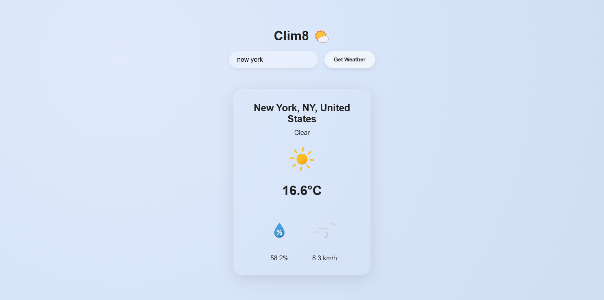

# clim8 - Current Weather App

**clim8** is a simple weather application that allows users to search for a country and view the current weather. It fetches live weather data from the Visual Crossing API to display the temperature, weather conditions, and more for the searched country.



## 🌤️ Live Demo

[👉 View Live](https://idevRavn.github.io/clim8)

## Features

- Search for a country to view its current weather.
- Displays weather information such as temperature, humidity, wind speed, and weather conditions.
- Clean and minimalistic design with a focus on usability.
- Built using Webpack for optimized performance and better bundling of assets.

## Getting Started

### 1️⃣ Clone the Repository

```bash
git clone https://github.com/idevRavn/clim8.git
cd wtodo
```

### 2️⃣ Install Dependencies

```bash
npm install
```

### 3️⃣ Development Mode

```bash
npm run dev
```

📌 Open **http://localhost:8080/** in your browser to view the site.

### **4️⃣ Build for Production**

```bash
npm run build
```

### **5️⃣ Deploy to Github Pages**

```bash
npm run deploy
```

## 🛠️ Tech Stack

- HTML
- CSS
- JavaScript
- Webpack
- [Visual Crossing API](https://www.visualcrossing.com/)

## Contributing

Contributions are welcome! If you have ideas for improvement or want to add features, please fork the repository and submit a pull request.

## License

This project is licensed under the [MIT License](LICENSE), allowing for collaboration and sharing.
